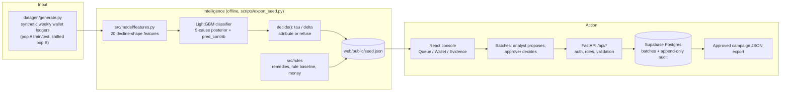

# WhyQuiet: Dormant-Wallet Diagnosis (Cause Desk)

**Live demo: https://whyquiet.vercel.app** (no login needed for the read-only console)

Submission for **AI DEV FEST 2026 AI Hackathon** (DIU CPC × upay), theme: digital financial services / MFS.

> *"Real ledgers contain no cause label. We train a multi-cause classifier on SIMULATED causes (population A) and evaluate it on a SHIFTED population B it has never seen. We claim robustness to distribution shift in simulation, not real-world accuracy."*

---

## Table of Contents

1. [Project Overview](#1-project-overview)
2. [Features](#2-features)
3. [Technology Stack](#3-technology-stack)
4. [Requirements](#4-requirements)
5. [Installation and Setup](#5-installation-and-setup)
6. [Environment Variables](#6-environment-variables)
7. [Run and Build Commands](#7-run-and-build-commands)
8. [Live Deployment URL](#8-live-deployment-url)
9. [Testing Instructions](#9-testing-instructions)
10. [Other Configuration](#10-other-configuration)
11. [Data](#11-data)
12. [AI Approach and Evaluation](#12-ai-approach-and-evaluation)
13. [Responsible AI](#13-responsible-ai)
14. [Architecture](#14-architecture)
15. [External Resources Disclosure](#15-external-resources-disclosure)
16. [Known Limitations](#16-known-limitations)
17. [Team](#17-team)

---

## 1. Project Overview

**Problem.** When a mobile wallet goes quiet, MFS operations teams usually apply one rule: *3 weeks without a transaction → send the same reactivation SMS to everyone.* But a wallet goes quiet for different reasons, and each needs a different fix:

| Cause | What happened (example) | What would actually help |
| --- | --- | --- |
| `job_exit` | Salary deposits stopped | Payroll re-link offer |
| `migration` | User moved district, lost their usual agents | Nearby-agent referral |
| `solved_problem` | One-off need (tuition, festival remittance) is done | Nothing, so spend nothing |
| `fee_shock` | Activity fell after a cash-out fee change | Fee waiver voucher |
| `supply_failure` | Repeated failed cash-outs at a cash-starved agent | Agent liquidity alert and re-routing |

A generic SMS fixes none of these well, and it spends money on wallets that need no action.

**Solution.** WhyQuiet reads the weekly transaction *shape* of each dormant wallet, names the most likely cause with a calibrated probability, attaches a priced, cause-specific remedy (English and Bengali message copy), and shows the money trade-off against the blanket rule. When the signal is ambiguous it **refuses** ("No attributable cause") and says why, instead of guessing. Remedies go out only as batches that one person proposes and a second person approves.

**Purpose.** Give operations teams a reason for each dormant wallet, so reactivation budget goes to fixable causes and every spend decision has a human sign-off and an audit trail.

**Problem statement.**
For **upay's MFS operations team**, **sending the same "come back" SMS to every wallet silent for 3+ weeks** causes **budget spent on wallets whose dormancy a generic message cannot fix, with no record of why each wallet went quiet**. We will build **WhyQuiet, a LightGBM cause classifier with calibrated refusal**, that uses **weekly wallet transaction histories (synthetic)** to **attribute one of five dormancy causes, or refuse, and route attributed wallets into priced, human-approved remedy batches**, with success measured by **macro-F1 on a shifted, never-seen population B (reported beside a rule baseline and a shuffled-label control), refusal rate, and net recovered value in BDT versus the blanket-SMS rule**.

---

## 2. Features

### Operator console (web, public read-only)

| Screen | Route | What it shows |
| --- | --- | --- |
| **Triage Queue** | `#/` | 400 population-B wallets (300 attributed, 100 refused) with verdict, cause, confidence, weeks silent, and what the 3-week rule would have done. Filter by verdict and cause, search, sort. Quick wallet lookup with `W-XXXXXX` format validation. |
| **Wallet Detail** | `#/w/<wallet_id>` | Weekly decline-shape chart with the silent window shaded; 5-cause posterior bar chart with the τ (confidence bar) line; top 8 signed feature contributions; "rule vs Cause Desk" comparison; remedy card with unit cost and bilingual message preview. |
| **Refusal view** | `#/w/<refused id>` | Headline *"No attributable cause. I will not spend your money here."*, the exact refusal reasons (τ and/or δ test that failed), and no action buttons. |
| **Evidence** | `#/evidence` | Population-B metrics (macro-F1, A→B gap, refusal rates, calibration error), rule baseline, shuffled-label control, best single feature, confusion matrix, subgroup table, and the money table with a 1% / 4% / 8% recovery-rate switch. All ASSUMED inputs are listed. |
| **Batches** | `#/batches` | Propose a cause-targeted batch (analyst), approve/reject with a required note (approver), download an approved batch as a campaign JSON. |
| Design system | `#/design` | Style tokens and components used by the console. |
| Light/dark mode | header toggle | Stored per browser. |

### Write-path API (FastAPI, Supabase-backed)

| Endpoint | Auth | Purpose |
| --- | --- | --- |
| `GET /api/health` | none | Status, version, and `store`: `supabase` when the write path is configured, `local` for the read-only demo. |
| `POST /api/auth/login` | none | Supabase email/password login → access token + role (`analyst` / `approver`). |
| `GET /api/batches` | none | List batches, newest first. |
| `POST /api/batches` | bearer, `analyst` | Propose a batch. Remedy code and unit cost are taken from `src/rules/remedies.py`, never from the client. 1–1000 wallet IDs matching `^W-[0-9A-Z]{6}$`. |
| `POST /api/batches/{id}/approve` | bearer, `approver` | Approve with a 1–500 char note. Approver must differ from proposer. |
| `POST /api/batches/{id}/reject` | bearer, `approver` | Reject with a 1–500 char note. |
| `GET /api/batches/{id}/export` | none | Campaign payload (wallet IDs, remedy, total cost) for an **approved** batch only. |
| `GET /api/docs` | none | Interactive OpenAPI docs. |

Database rules (Postgres triggers and constraints in `supabase/migrations/`): two-person rule, a wallet can sit in only one open batch, decided batches are locked, and the audit log is append-only (UPDATE/DELETE/TRUNCATE blocked).

### How the AI is used

| AI component | What it predicts / produces | Where it appears |
| --- | --- | --- |
| **LightGBM multiclass classifier** (`src/model/train.py`) | Probability of each of the 5 causes from 20 decline-shape features (`src/model/features.py`). | Posterior chart and confidence on Wallet Detail; cause column in the Queue; confusion matrix on Evidence. |
| **Calibrated refusal** (`decide()` in `src/model/train.py`) | Attributes a cause only if top probability ≥ τ **and** top-minus-second ≥ δ. τ and δ are tuned on a validation slice of A-train to the lowest refusal rate that keeps attributed wallets ≥ 97% accurate. Shipped values: **τ = 0.80, δ = 0.10**. | Verdict chip (attributed / refused) and plain-English refusal reasons on every wallet. |
| **Per-wallet explanations** (LightGBM `pred_contrib`, i.e. tree SHAP values, computed natively without the `shap` package) | Signed contribution of each feature toward the predicted cause. | "Why" panel on Wallet Detail (top 8 features). |

Everything after the classifier is deterministic code in `src/rules/`: the 3-week rule baseline (`baseline.py`), the remedy catalogue with costs and messages (`remedies.py`), and the money model (`money.py`). There is **no LLM** in this project; message copy is fixed, human-written text.

**Important:** the model runs **offline**. `scripts/export_seed.py` generates data, trains, scores population B and writes `web/public/seed.json`; the deployed console reads that file. The serverless API does not load LightGBM (see [Known Limitations](#16-known-limitations)).

---

## 3. Technology Stack

| Layer | Technology |
| --- | --- |
| Languages | Python 3.12, TypeScript 5.8, SQL (PostgreSQL) |
| ML | LightGBM ≥ 4.7 (multiclass GBDT, `pred_contrib` explanations), scikit-learn ≥ 1.9 (split, class weights, F1, confusion matrix), NumPy ≥ 2.4, pandas ≥ 3.0, PyArrow ≥ 25 (Parquet) |
| AI models | One model, trained from scratch by this repo: `lgbm-v1` (LightGBM, 100 rounds, learning rate 0.05, 15 leaves, balanced class weights, deterministic seed). **No pretrained models, no LLMs, no external AI APIs.** |
| Backend | FastAPI ≥ 0.142, Pydantic v2, Uvicorn ≥ 0.54, `supabase` Python client ≥ 2.32, httpx |
| Frontend | React 19, Vite 8, Tailwind CSS 4, Recharts 3, `openapi-typescript` (types generated from the API schema) |
| Database / Auth | Supabase (Postgres, Supabase Auth with `app_metadata.role`) |
| Hosting / CI | Vercel (static site + Python serverless function `api/index.py`), GitHub Actions (`ci.yml`, `deploy.yml`) |
| Tooling | uv (Python packages), npm, Ruff, Pyright, pytest, oxlint, Playwright, GNU Make (optional) |

Exact versions are pinned in `uv.lock` and `web/package-lock.json`.

---

## 4. Requirements

**Software**

| Tool | Version | Notes |
| --- | --- | --- |
| Python | 3.12 (`.python-version`; `pyproject.toml` allows ≥ 3.11) | uv installs it for you if missing |
| [uv](https://docs.astral.sh/uv/) | 0.12.x (tested 0.12.22) | Python package manager |
| Node.js | 22 (CI uses 22; tested 22.14) | Vite 8 needs Node ^20.19 or ≥ 22.12 |
| npm | ships with Node | |
| Git | any recent | |
| GNU Make | optional | Not on Windows by default; every `make` target has a plain command below |
| Supabase CLI | optional | Only to create your own write-path database |

**Hardware.** CPU only, no GPU. Training and evaluation use LightGBM on CPU over 9,000 synthetic wallets. <!-- TODO: measure and state peak RAM and run time of `scripts/export_seed.py` on a typical laptop. -->

**Accounts / API keys**

- **None** to run the read-only console, the model pipeline, or the tests.
- A free **Supabase** project only if you want the write path (login, batches) locally.
- A **Vercel** account only to deploy your own copy.
- Judges can use the hosted write path with the demo accounts `analyst@whyquiet.demo` and `approver@whyquiet.demo`. Passwords are never stored in git. <!-- TODO: state where judges get the demo passwords (e.g. submission form field). -->

---

## 5. Installation and Setup

Commands are for bash (Linux, macOS, Git Bash on Windows). PowerShell equivalents are noted where they differ.

1. **Clone the repository**
   ```bash
   git clone https://github.com/shads-01/whyquiet-dormant-wallet-diagnosis.git
   cd whyquiet-dormant-wallet-diagnosis
   ```

2. **Install Python dependencies** (creates `.venv`, includes dev tools)
   ```bash
   uv sync
   ```

3. **Install frontend dependencies**
   ```bash
   cd web
   npm ci
   cd ..
   ```

4. **Install the Playwright browser** (only needed for end-to-end tests)
   ```bash
   cd web
   npx playwright install chromium
   cd ..
   ```

5. **Create your local env file**
   ```bash
   cp .env.example .env
   ```
   PowerShell: `Copy-Item .env.example .env`. Leaving every value empty gives a working read-only setup. See [Environment Variables](#6-environment-variables).

6. **Model and seed data: nothing to download.** The trained model output ships in `web/public/seed.json`, so the console works right after step 3. To regenerate it from scratch (generate synthetic data → train → score population B → evaluate → write the seed):
   ```bash
   uv run python scripts/export_seed.py --seed 42
   ```
   This writes `data/train/`, `data/a_test/`, `data/b/`, `truth/` (all gitignored) and overwrites `web/public/seed.json`. Expected last line:
   ```text
   wrote seed.json: 400 wallets (100 refused), B macro-F1 0.8636
   ```
   To generate only the synthetic data: `uv run python -m datagen.generate --seed 42`.

7. **Optional: set up the write-path database** (Supabase)
   1. Create a project at https://supabase.com and copy its URL and `service_role` key into `.env`.
   2. Apply the two migrations in `supabase/migrations/` (in filename order):
      ```bash
      supabase link --project-ref <your-project-ref>
      supabase db push
      ```
      Or paste `20261003180000_audit_log.sql`, then `20261003215000_remedy_batches.sql`, into the Supabase SQL editor.
   3. Set `DEMO_ANALYST_PASSWORD` and `DEMO_APPROVER_PASSWORD` in `.env`, then create the two demo accounts (idempotent):
      ```bash
      uv run --env-file .env python supabase/seed_demo_users.py
      ```
      Expected output: `created analyst@whyquiet.demo -> analyst` and `created approver@whyquiet.demo -> approver`.

---

## 6. Environment Variables

All variables live in `.env` (gitignored by the `.env*` rule in `.gitignore`; only `.env.example` is committed). Never put real values in git.

| Variable | Purpose | Required? | How to obtain / configure |
| --- | --- | --- | --- |
| `SUPABASE_URL` | Supabase project URL for login, batches and the audit log. Read by `src/api/auth.py`, `src/api/store.py`. | Only for the write path. Without it the read-only console still works and write endpoints return 503. | Supabase dashboard → Project Settings → API → Project URL, e.g. `https://<project-ref>.supabase.co` |
| `SUPABASE_SERVICE_ROLE_KEY` | Server-side key the API uses for Auth and database calls. Must never reach the browser. | Only for the write path | Supabase dashboard → Project Settings → API → `service_role` secret |
| `DEMO_ANALYST_PASSWORD` | Password set on `analyst@whyquiet.demo` by `supabase/seed_demo_users.py` | Only when running that script | Choose one |
| `DEMO_APPROVER_PASSWORD` | Password set on `approver@whyquiet.demo` by the same script | Only when running that script | Choose one (different from the analyst's) |
| `SUPABASE_ANON_KEY` | Not read by application code; kept for Supabase CLI / manual use | No | Supabase dashboard → Project Settings → API → `anon` key |
| `SUPABASE_DB_PASSWORD` | Not read by application code; database password for `supabase db push` | No | Set when creating the Supabase project |
| `API_PORT` | Port the Vite dev server proxies `/api` to (`web/vite.config.ts`) | No (default `8008`) | Set in the shell that runs `npm run dev` |

**Deployment (Vercel project settings):** only `SUPABASE_URL` and `SUPABASE_SERVICE_ROLE_KEY`.
**CI/CD (GitHub Actions secrets):** `VERCEL_TOKEN`, `VERCEL_ORG_ID`, `VERCEL_PROJECT_ID`. See [`docs/DEPLOYMENT.md`](docs/DEPLOYMENT.md).

---

## 7. Run and Build Commands

### Development

| Part | Command | URL |
| --- | --- | --- |
| API + web together | `make dev` | API http://localhost:8008, web http://localhost:5173 |
| API only | `uv run --env-file .env uvicorn src.api.main:app --port 8008` | http://localhost:8008/api/health, docs at http://localhost:8008/api/docs |
| Web only | `cd web && npm run dev` | http://localhost:5173 (proxies `/api` to port 8008) |

Without `make` (e.g. Windows), open two terminals:
```bash
# terminal 1 (repo root)
uv run --env-file .env uvicorn src.api.main:app --port 8008
```
```bash
# terminal 2
cd web
npm run dev
```
The web console still works if the API is down: read screens use `seed.json` and the header badge shows "API down".

### Offline ML pipeline

```bash
uv run python -m datagen.generate --seed 42      # synthetic data only -> data/, truth/
uv run python scripts/evaluate.py --seed 42      # metrics JSON (needs the data above)
uv run python scripts/export_seed.py --seed 42   # full pipeline -> web/public/seed.json
```

### Production build

```bash
cd web
npm run build      # type-check + bundle into web/dist
npm run preview    # serve the built site at http://localhost:4173
```
Production API server (no reload):
```bash
uv run --env-file .env uvicorn src.api.main:app --host 0.0.0.0 --port 8008
```

### Other

```bash
make gen-types                                  # regenerate web/src/api/openapi.json and schema.d.ts from FastAPI
make deploy                                     # npx -y vercel --prod (needs a linked Vercel project)
make verify-deploy URL=https://whyquiet.vercel.app
```
Without make: `uv run python scripts/export_openapi.py`, then `cd web && npx openapi-typescript src/api/openapi.json -o src/api/schema.d.ts`; `uv run python scripts/verify_deploy.py https://whyquiet.vercel.app`.

---

## 8. Live Deployment URL

### **https://whyquiet.vercel.app**

- Read-only console (Queue, Wallet Detail, Refusal, Evidence): public, no login.
- API health: https://whyquiet.vercel.app/api/health
- API docs: https://whyquiet.vercel.app/api/docs
- Write path is connected to Supabase in production (`"store":"supabase"` in the health response).

Deployment is automatic: `.github/workflows/deploy.yml` deploys to Vercel only after the CI workflow passes on `main`, then runs `scripts/verify_deploy.py` against the production URL.

---

## 9. Testing Instructions

### Automated tests

```bash
uv run pytest -q
```
105 tests (data generator, features, model training and evaluation, rules, money model, seed export, API validation/auth/authorization with a mocked Supabase, plus guard tests that `src/model` never imports `truth/` and the runtime never imports `shap`). Takes about 2–3 minutes because model tests generate data and train. No Supabase or network needed.

```bash
make e2e          # or: cd web && npx playwright test
```
27 Playwright tests across 6 specs (`web/e2e/`). The config starts the API on 8008 and Vite on 5173 automatically.

```bash
make check
```
Full quality gate used by CI: Ruff, Pyright, pytest, OpenAPI type regeneration plus a `git diff` drift check, `tsc`, oxlint, and a production Vite build. Without make, run each line of the `check` target in the `Makefile` by hand.

```bash
make verify-deploy URL=https://whyquiet.vercel.app
```
Checks `/api/health`, `/api/openapi.json`, `/api/batches` and the home page title on a deployed site. Expected last line: `PASS`.

### Manual walkthrough (about 5 minutes)

Use the live site or `make dev` locally.

| # | Do this | Expected result |
| --- | --- | --- |
| 1 | Open `/` (Triage Queue) | 400 wallets; the verdict filter shows 300 attributed and 100 refused. |
| 2 | Open `#/w/W-1SVVT9` | **Attributed: Fee Shock**, confidence ≈ 0.99. Top reasons include `weeks_silent` (12) and `ticket_ratio` (0.73, average ticket fell). Remedy: *Cash-out fee waiver voucher*, 25 BDT (ASSUMED), English and Bengali copy. Rule column: "message everyone". |
| 3 | Open `#/w/W-N0S673` | **Attributed: Supply Failure**, ≈ 1.00. Top reason `fail_last6` = 5 failed cash-outs in the last 6 active weeks. Remedy: *Agent liquidity alert & routing*, 5 BDT. |
| 4 | Open `#/w/W-YF15RF` | **Attributed: Migration**, ≈ 0.95. Top reason `weeks_since_district_change` = 3. |
| 5 | Open `#/w/W-1JRE6D` | **Refused.** "No attributable cause. I will not spend your money here." Reason: *Top cause fee_shock 0.45 is below the 0.80 bar (tau)*. No action buttons. |
| 6 | Open `#/w/W-06VLT1` | **Refused** with both tests failing: the τ reason and *fee_shock vs solved_problem margin … is below 0.10 (delta)*. |
| 7 | In the Queue's Quick Wallet Diagnostic, type `W-123` | Validation error: *Wallet ID must follow format W-XXXXXX*. |
| 8 | Open `#/evidence` | Macro-F1 on B 86.4%, A-test 96.2%, refusal 21.7% on B, rule baseline 8.2%, shuffled control 16.2%, best single feature `cashin_ratio_last4` 37.3%. Switch recovery rate 1% / 4% / 8% to see the money table change. |

**API checks without Supabase** (empty `.env`, API running locally):
```bash
curl http://localhost:8008/api/health
# {"status":"ok","version":"0.1.0","store":"local","stub":false}
curl http://localhost:8008/api/batches
# {"detail":"Write path offline"}   (HTTP 503)
```

**Write-path checks with Supabase** (local Supabase set up in step 7, or the live URL with the judge demo passwords):
```bash
BASE=http://localhost:8008   # or https://whyquiet.vercel.app
A=$(curl -s -X POST $BASE/api/auth/login -H 'Content-Type: application/json' \
  -d '{"email":"analyst@whyquiet.demo","password":"<analyst-password>"}' | uv run python -c "import sys,json;print(json.load(sys.stdin)['access_token'])")
P=$(curl -s -X POST $BASE/api/auth/login -H 'Content-Type: application/json' \
  -d '{"email":"approver@whyquiet.demo","password":"<approver-password>"}' | uv run python -c "import sys,json;print(json.load(sys.stdin)['access_token'])")

# 422: bad wallet ID format
curl -s -X POST $BASE/api/batches -H "Authorization: Bearer $A" -H 'Content-Type: application/json' -d '{"cause":"fee_shock","wallet_ids":["W-123"]}'
# 401: no token
curl -s -X POST $BASE/api/batches -H 'Content-Type: application/json' -d '{"cause":"fee_shock","wallet_ids":["W-1SVVT9"]}'
# 403: approver cannot propose
curl -s -X POST $BASE/api/batches -H "Authorization: Bearer $P" -H 'Content-Type: application/json' -d '{"cause":"fee_shock","wallet_ids":["W-1SVVT9"]}'
# 200: analyst proposes -> note the "id"; remedy_code fee_shock_waiver, unit_cost_bdt 25.0 come from the server
curl -s -X POST $BASE/api/batches -H "Authorization: Bearer $A" -H 'Content-Type: application/json' -d '{"cause":"fee_shock","wallet_ids":["W-1SVVT9"]}'
# 403: analyst cannot approve; 200: approver approves with a note
curl -s -X POST $BASE/api/batches/<id>/approve -H "Authorization: Bearer $A" -H 'Content-Type: application/json' -d '{"note":"ok"}'
curl -s -X POST $BASE/api/batches/<id>/approve -H "Authorization: Bearer $P" -H 'Content-Type: application/json' -d '{"note":"Checked cause and cost"}'
# 200: campaign export of the approved batch
curl -s $BASE/api/batches/<id>/export
```
Proposing the same wallet again while its batch is still open returns 409 *A wallet is already in an open batch*. Note that these calls write real rows to the database's append-only audit log.

---

## 10. Other Configuration

| File / folder | Role |
| --- | --- |
| `web/public/seed.json` | Committed model output: 400-wallet stratified sample of population B with posteriors, contributions, refusal reasons, plus the full-B evaluation report, money table, assumptions and remedy catalogue. Regenerate with `scripts/export_seed.py`. Format: [`docs/contracts/seed-bundle.md`](docs/contracts/seed-bundle.md). |
| `web/public/seed.sample.json` | Hand-made 20-wallet fixture. The UI falls back to it (with a "Sample data mode" banner) only if `seed.json` cannot load. |
| `web/src/api/openapi.json`, `schema.d.ts` | Generated API types; keep in sync with `make gen-types` (CI fails on drift). |
| `supabase/migrations/` | All database schema changes. Never edit the database by hand. |
| `supabase/seed_demo_users.py` | Creates/updates the two demo accounts and their roles. |
| `vercel.json`, `.vercelignore` | Build settings, `/api/*` rewrite to `api/index.py`, and an allowlist so `.env`, `data/` and `truth/` are never uploaded. |
| `requirements.txt`, `api/requirements.txt` | Slim runtime deps for the Vercel function (no ML packages). |
| `.github/workflows/` | `ci.yml` (check + e2e on every push/PR), `deploy.yml` (production deploy after green CI on `main`). |
| `docs/` | `DECISIONS.md` (decision log), `contracts/api.md` (API contract), `database-schema.md`, `DEPLOYMENT.md`, `TEST_REPORT.md`. |

**Access roles.** Roles come from Supabase `app_metadata.role` (`analyst` or `approver`), set only by the service-role seed script. An account without a role gets 403.

---

## 11. Data

- **Synthetic only.** Every wallet, transaction and cause label is generated by `datagen/generate.py`. No real customer data, no PII, no data from upay, bKash, Nagad or any other provider. Wallet IDs are random pseudonyms of the form `W-XXXXXX`.
- **Why synthetic.** No public dataset labels *why* a wallet went dormant, so we simulate the causes and are explicit about what that does and does not prove (see the honesty line at the top).

**How it is generated** (`uv run python -m datagen.generate --seed 42`, fully reproducible from the seed):

| Population | Wallets | Use |
| --- | --- | --- |
| A-train | 4,800 | Training and τ/δ tuning (labels in `data/train/labels.parquet`) |
| A-test | 1,200 | In-distribution test (labels only in `truth/`) |
| B | 3,000 | Shifted evaluation population; headline metrics (labels only in `truth/`) |

Each wallet gets 52 weeks of weekly rows (`txn_count`, `amount_bdt`, `cashin_count`, `cashout_ok`, `cashout_fail`, `app_share`, `district_changed`), a worker type (garment, domestic, transport, retail) and a pay cycle (weekly, biweekly, monthly). Every wallet ends with at least 3 silent weeks.

**Injected patterns per cause** (before the wallet goes silent):

| Cause | Pattern injected |
| --- | --- |
| `job_exit` | Cash-ins (salary) stop 2–4 weeks before dormancy; dormancy starts just after a payday |
| `migration` | District change 2–6 weeks before dormancy, app usage share rises, activity ramps down to 30% |
| `solved_problem` | Low baseline activity, one large burst (5× count, 3× ticket size), then near silence |
| `fee_shock` | After the fee week, ticket size falls first, then transaction count falls to 30% |
| `supply_failure` | Failed cash-outs ramp from 1 to 4 per week; successful cash-outs drop to 20% |

**Noise and ambiguity on purpose:** 20% (A) / 30% (B) of wallets blend their cause with a second cause's pattern; 5% of non-supply wallets get stray failed cash-outs; 3% of non-migration wallets get a stray district change; everyone sees a small ticket drop after the fee week; holiday weeks cut activity.

**Distribution shift A → B** (all ASSUMED design choices): pay cycles (40/20/40% → 20/20/60% weekly/biweekly/monthly), cause mix, worker mix, median activity 5 → 3 transactions/week, noise σ 0.3 → 0.5, holidays move ~2 weeks earlier, app share 0.60 → 0.35, fee week 38 → 34, different lags and ramps, more blending.

**Assumptions.** Every generator number is ASSUMED except the population-A mix of `job_exit` / `solved_problem` / `fee_shock`, which is rounded from the IFC Côte d'Ivoire DFS inactivity survey reported in the World Bank paper *Who will Churn?* ([PDF](https://documents1.worldbank.org/curated/en/991761592191000636/pdf/Who-will-Churn-Leveraging-Predictive-Modeling-for-Insights-and-Action-on-DFS-Customer-Inactivity.pdf)). The mapping from survey answers to our causes is ours; `migration` and `supply_failure` shares are ASSUMED. Full rationale: `docs/DECISIONS.md` (D21).

**Leakage guard.** Labels for A-test and B are written only to `truth/` (gitignored). `src/model/` must never import `truth/`; `tests/test_no_truth_import.py` enforces this.

---

## 12. AI Approach and Evaluation

**Model.** 20 hand-built shape features per wallet (`src/model/features.py`), each measured against the wallet's *own* earlier baseline so they survive population B's lower activity: e.g. `last4_txn_ratio`, `slope_last8`, `cashin_ratio_last4`, `weeks_since_district_change`, `app_share_shift`, `burst_ratio`, `post_fee_ratio`, `fail_last6`, `fail_rate_last6`, `fade_weeks`. A LightGBM multiclass model (balanced class weights) maps them to five cause probabilities; `decide()` applies the τ/δ refusal rule.

**Why AI beats a simple rule here.** The incumbent rule (`weeks_silent ≥ 3 → message everyone`) fires on every dormant wallet and cannot name a cause at all. Five causes leave overlapping, noisy traces across several signals at once (cash-ins, failures, district, ticket size, timing relative to the fee week), and blends and stray clues make single thresholds brittle. The numbers below show it: the best *single* feature reaches 37.3% macro-F1 on B; the full model reaches 86.4% on the wallets it attributes.

**Results** (seed 42, from `web/public/seed.json`, reproduced by `scripts/evaluate.py --seed 42`). Headline is **population B only**.

| Metric | Value |
| --- | --- |
| **Macro-F1, population B (attributed wallets)** | **0.864** |
| Macro-F1, A-test (in-distribution) | 0.962 |
| Gap A-test − B | 0.098 |
| Refusal rate A-test / B | 9.3% / 21.7% (refuses more under shift, as intended) |
| Expected calibration error on B (10 bins) | 0.100 |
| Rule baseline macro-F1 on B (majority cause of A-train for all wallets) | 0.082 |
| Shuffled-label control on B | 0.162 (chance ≈ 0.20) |
| Best single feature on B (`cashin_ratio_last4`) | 0.373 |
| Seeds 1, 2, 3 (stability check, D33 in `docs/DECISIONS.md` / `docs/STATE.md`) | B macro-F1 mean 0.868, range 0.847–0.886 |

How to read this fairly: the model's F1 counts only the 78.3% of B wallets it attributes; the controls cannot refuse and are scored on all of B. Refusal is the price of the higher accuracy, and it is reported next to it.

**Money model** (`src/rules/money.py`, all of population B, 3,000 wallets; every input ASSUMED: ARPU 120 BDT/month, 3-month value ramp, generic SMS 0.50 BDT and 25% as effective as a targeted remedy, targeted remedy 11 BDT on average):

| Recovery rate | Rule (SMS everyone) net BDT | WhyQuiet net BDT | Oracle net BDT |
| --- | ---: | ---: | ---: |
| 1% | +1,200 | −18,231 | −22,200 |
| 4% | +9,300 | +4,560 | +10,200 |
| 8% | +20,100 | +34,947 | +53,400 |

Honest reading: with these assumed costs, cause targeting only beats the cheap blanket SMS when the targeted recovery rate is high (8%); at 1% and 4% the rule's low cost wins. The point of the table is to make that break-even visible and adjustable, not to claim a win. Real recovery rates and costs are exactly what upay data would need to supply.

---

## 13. Responsible AI

**Explainability**
- Every wallet shows its full 5-cause posterior and its top 8 signed feature contributions (LightGBM tree-SHAP values via `pred_contrib`), with each feature's actual value.
- Refusals list the exact failed test in plain words, e.g. *"Top cause fee_shock 0.45 is below the 0.80 bar (tau)"*. Refusal is a normal output with reasons, never an exception.
- Every assumed number is labelled ASSUMED in code and on the Evidence screen.

**Fairness checks** (population B, from `scripts/evaluate.py`)

| Slice | Group | n | Macro-F1 | Refusal rate |
| --- | --- | ---: | ---: | ---: |
| Worker type | domestic | 765 | 0.876 | 23.8% |
| | garment | 698 | 0.891 | 21.8% |
| | retail | 554 | 0.849 | 17.9% |
| | transport | 983 | 0.842 | 22.3% |
| Pay cycle | biweekly | 586 | 0.880 | 21.0% |
| | monthly | 1,824 | 0.856 | 23.2% |
| | weekly | 590 | 0.864 | 18.0% |

Macro-F1 stays within 0.84–0.89 across occupation groups and pay cycles. Limits: the synthetic data has no gender, age or region attributes, so this is a check across occupation and income rhythm only, and it is on simulated wallets.

**Security**
- **Prompt injection:** not applicable; there is no LLM and no free-text model input. All decision logic is deterministic code.
- **Data leakage:** held-out labels live only in `truth/`; a test forbids `src/model` from importing them. `.vercelignore` is an allowlist, so `.env`, `data/` and `truth/` cannot be uploaded to Vercel.
- **Secrets:** only in environment variables; `.env*` is gitignored; the service-role key is used server-side only.
- **Access control:** bearer-token auth via Supabase; role checks in the API (`analyst` proposes, `approver` decides); remedy code and cost are computed on the server from `src/rules`, not accepted from the client; strict input validation (wallet ID regex, 1–1000 wallets, 1–500 char notes). In Postgres: row-level security on all tables, write functions executable only by `service_role`, two-person check constraint, one-open-batch unique index, append-only audit log enforced by triggers.

**Human oversight**
- WhyQuiet never sends a message. Its only output is a campaign JSON for an **approved** batch.
- Maker-checker: an analyst proposes, a *different* approver approves or rejects with a required note. Enforced in the API and again in the database.
- Every propose/approve/reject is written to an append-only audit log.
- Refused wallets cannot be turned into a remedy by the model; a human decides what, if anything, to do with them.

---

## 14. Architecture



**Connecting to a real upay backend later.** The model needs only weekly aggregates per wallet (the seven columns above), which can be computed from a ledger without names, numbers or NIDs. The integration path would be: (1) a scheduled job that exports pseudonymised weekly aggregates for wallets silent ≥ 3 weeks; (2) run `features()` and the trained model on that table, which is the same code path as `export_seed.py`; (3) first fit the cause model on outcomes from small labelled pilot campaigns, since real ledgers contain no cause label; (4) hand the approved campaign JSON (`GET /api/batches/{id}/export`) to upay's existing outbound messaging system. <!-- TODO: confirm with upay what ledger fields and campaign-system input format would be available. -->

---

## 15. External Resources Disclosure

| Resource | Type | Used for |
| --- | --- | --- |
| World Bank / IFC, *Who will Churn? Leveraging Predictive Modeling for Insights and Action on DFS Customer Inactivity* ([PDF](https://documents1.worldbank.org/curated/en/991761592191000636/pdf/Who-will-Churn-Leveraging-Predictive-Modeling-for-Insights-and-Action-on-DFS-Customer-Inactivity.pdf)) | Published survey figures | Rounded cause mix for three causes in population A. No data rows were copied. |
| LightGBM, scikit-learn, NumPy, pandas, PyArrow | Open-source libraries | Model training, metrics, data handling |
| FastAPI, Pydantic, Uvicorn, supabase-py, httpx | Open-source libraries | API |
| React, Vite, Tailwind CSS, Recharts, openapi-typescript | Open-source libraries | Web console |
| Supabase | Hosted service | Postgres database and authentication |
| Vercel | Hosted service | Hosting and serverless API |
| GitHub Actions | Hosted service | CI/CD |
| Ruff, Pyright, pytest, oxlint, Playwright | Open-source tools | Quality checks and tests |
| AI coding assistants (Claude Code, Antigravity, OpenCode) | Development tools | Used by the team during development; listed in `CLAUDE.md` / `AGENTS.md` |

**Not used:** no external datasets, no pretrained models, no LLM or other AI APIs at runtime. The trained model is produced entirely by this repository's code from synthetic data.

---

## 16. Known Limitations

- **Simulated causes.** Accuracy is measured on simulated populations; it is evidence of robustness to shift in simulation, not of real-world accuracy.
- **Model is offline.** The console reads precomputed results from `seed.json`. The serverless API does not run the model. The Queue's Quick Wallet Diagnostic calls `POST /api/triage`, which is not implemented, and falls back to looking the wallet up in the seed.
- **Console sign-in is a client-side demo.** The header's Sign In stores the chosen role in the browser without calling `POST /api/auth/login`, and the Batches screen falls back to local in-browser batches when an API call fails. Authentication, roles and the two-person rule are enforced by the **API and database** (verify with the `curl` steps in [Testing](#9-testing-instructions)), not by the UI. Tracked as bugs #2–#6 in [`docs/TEST_REPORT.md`](docs/TEST_REPORT.md). <!-- TODO: remove or update this bullet if the UI is wired to the real login before submission. -->
- **Public read endpoints.** `GET /api/batches` and `GET /api/batches/{id}/export` need no login. They expose only pseudonymous synthetic wallet IDs.
- **Money model inputs are all ASSUMED** (ARPU, costs, recovery rates).

---

## 17. Team

<!-- TODO: fill in full names, roles and contacts as registered for the hackathon. -->

| Name | Role | Main areas in this repo |
| --- | --- | --- |
| Hrittika Saha | <!-- TODO: role --> | Data generator, model, evaluation, seed export (`datagen/`, `src/model/`, `scripts/`) |
| Shads | <!-- TODO: full name, role --> | Web console (`web/`) |
| Arko | <!-- TODO: full name, role --> | Rules, API, database, deployment (`src/rules/`, `src/api/`, `supabase/`) |

---

*Compliance: all data is synthetic and generated by `datagen/generate.py`. No real customer records or PII from any financial institution were used, and no real SMS or vouchers are ever sent.*
