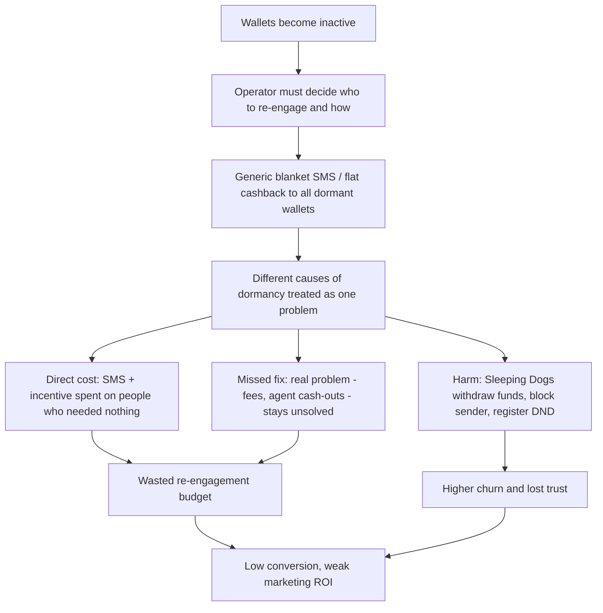
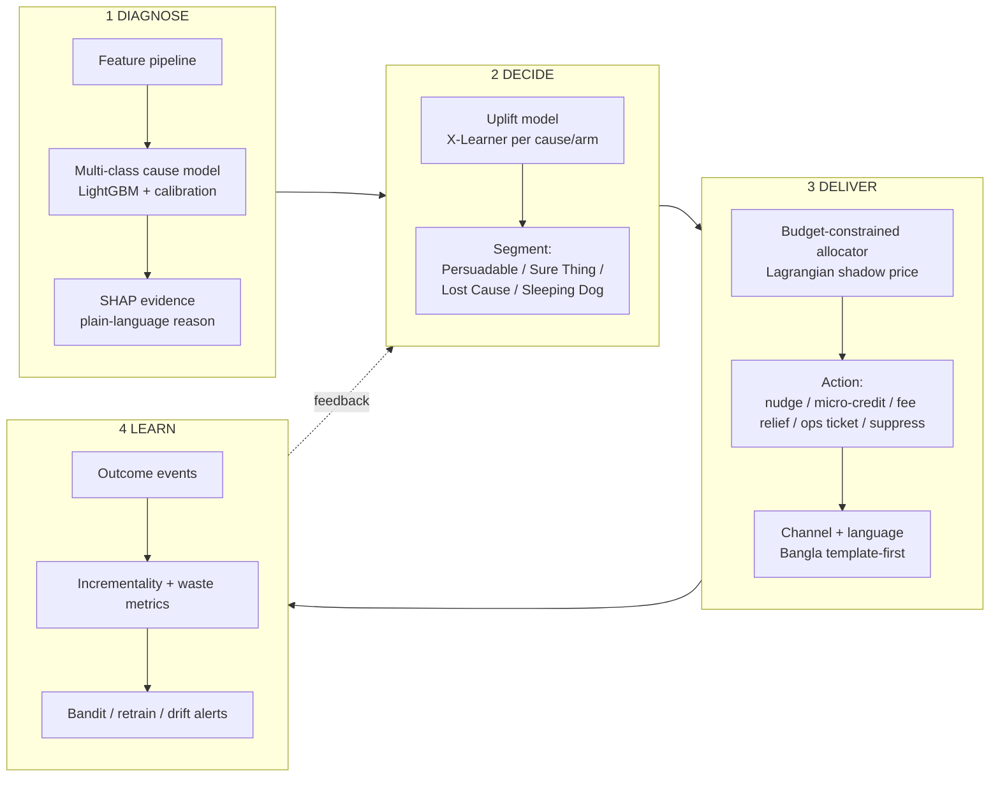
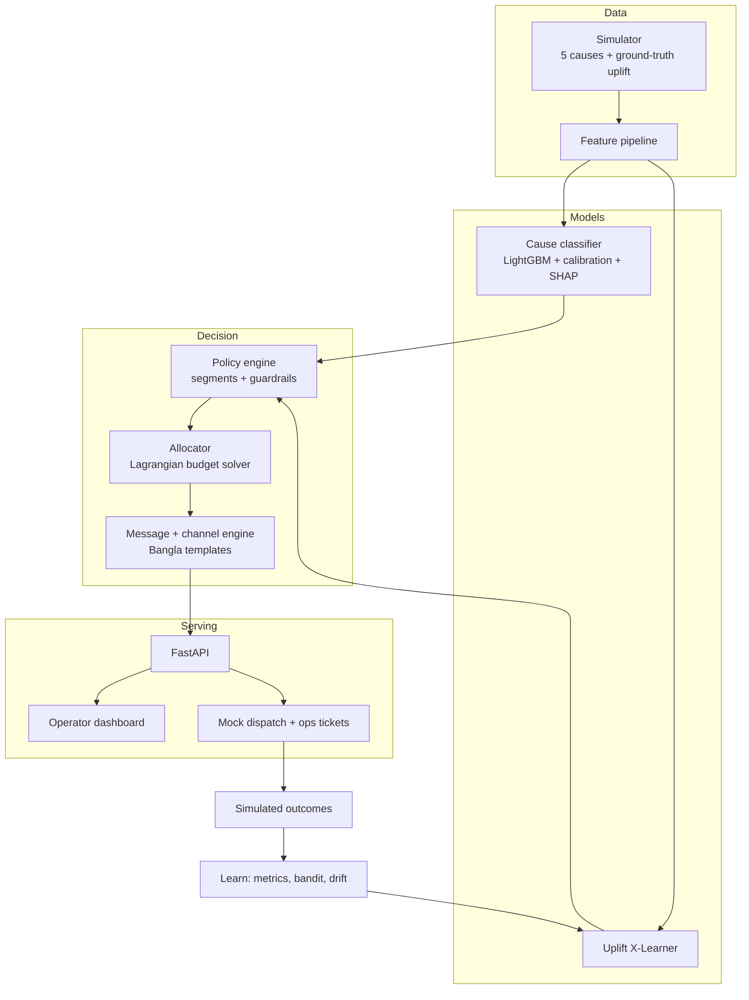
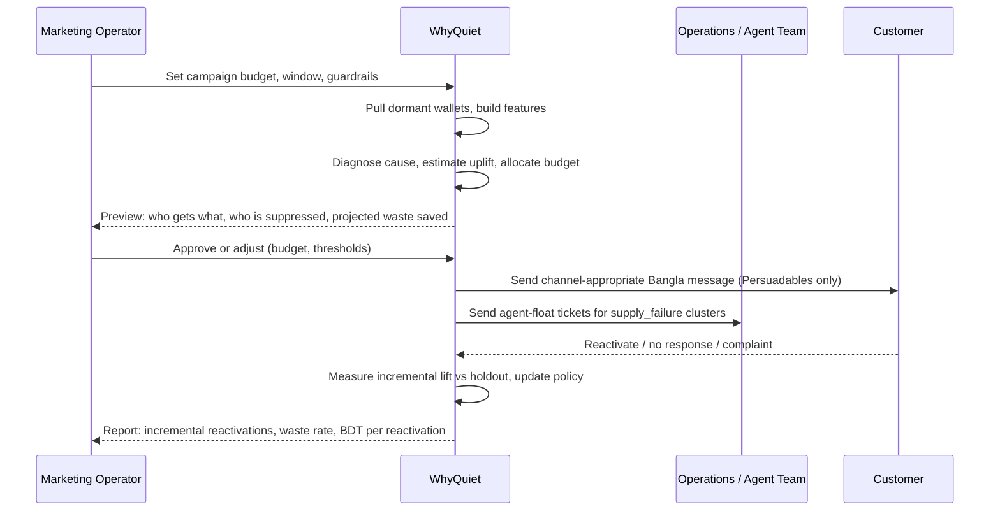
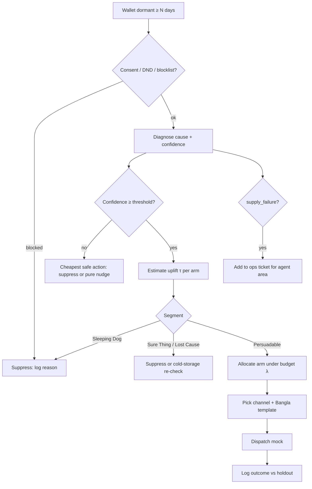

# WhyQuiet — Problem, Judge Feedback & Unified Solution Blueprint

**Event:** AI DEV FEST 2026 — AI Hackathon (DIU-CPC, Daffodil International University)
**Domain:** Mobile Financial Services (MFS) — dormant-wallet re-engagement
**Team format:** 1–3 members · 72-hour initial build · on-site update round · 90-minute final evaluation
**Purpose of this document:** one reference that (1) states the problem and why it matters, (2) records the judges' feedback faithfully, (3) merges the supplied research solution with additional ideas into one best-possible design, and (4) lays out a professional, step-by-step workflow to build, demo and defend it.

---

## 0. Document Control

| Item                | Detail                                                                                                                                                                                                                         |
| ------------------- | ------------------------------------------------------------------------------------------------------------------------------------------------------------------------------------------------------------------------------ |
| Inputs used         | `AI_DEV_FEST_2026_AI_Hackathon_Rulebook.md`, `judgeFeedback.md`, `solution.md` (causal re-engagement research brief)                                                                                                           |
| Not supplied        | A separate "problem set" file was not in the upload. The problem is reconstructed from the judge feedback and the project's own framing. If an official problem statement exists, paste its wording into §2.1 and re-check §3. |
| Project name        | **WhyQuiet** — "know _why_ a wallet went quiet before you spend a taka to wake it"                                                                                                                                             |
| Honest-status notes | Statistics quoted from the research brief are **unverified** until you confirm them (see §2.4). Several `[cite: …]` artifacts in the source brief must not be copied into the report.                                          |

---

## 1. Executive Summary

**Problem.** Bangladeshi MFS operators hold hundreds of millions of registered wallets but only a minority are active. The standard response is a **blanket reactivation SMS / flat cashback** sent to everyone dormant for N days. It is expensive, converts poorly, annoys customers, and — worst — treats five very different situations as one.

**What the judges said.** All three judges validated the problem as real and relevant. Judge 3 called the formulation "exceptional" because it replaces blanket SMS with **five distinct root-cause diagnoses**. Nobody said the problem was weak. The only open task is to make its **real-world importance, operational pain and cost consequences impossible to miss** — in the video, the report, the README and the live demo.

**Unified solution.** WhyQuiet runs every dormant wallet through four decisions:

1. **Diagnose** — _why_ did it go quiet? (`job_exit`, `migration`, `solved_problem`, `fee_shock`, `supply_failure`) with plain-language explanation.
2. **Decide** — _should we contact at all?_ Uplift modelling separates Persuadables from Sure Things, Lost Causes and Sleeping Dogs.
3. **Deliver** — _what is the smallest effective action, on which channel, in what language?_ Budget-constrained allocation + Bangla-first messaging, or a non-marketing fix (e.g., agent float ticket).
4. **Learn** — measure true incremental lift and wasted spend, feed results back.

**Headline metric to put on every artefact:** **Wasted Spend Rate** — the share of re-engagement budget spent on wallets that would have returned anyway, never would return, or would react negatively — _blanket vs WhyQuiet_, measured on a simulator where the ground truth is known.

---

## 2. The Problem

### 2.1 Problem statement (use this wording)

> MFS operators re-engage dormant wallets with generic, undifferentiated outreach. Wallets go dormant for fundamentally different reasons, and many of those reasons cannot be fixed by a message at all. As a result, re-engagement budget is spent on customers who need nothing, cannot be recovered, or are pushed away by the contact — while customers with a _fixable_ problem receive an irrelevant offer.

### 2.2 The cause-and-effect chain (from the judge brief, extended with consequences)



### 2.3 Why it matters — the three stakeholders

| Stakeholder                                        | Pain today                                                                                                | Consequence                                                          |
| -------------------------------------------------- | --------------------------------------------------------------------------------------------------------- | -------------------------------------------------------------------- |
| **MFS operator / marketing team**                  | Budget burned on mass SMS and flat incentives; cannot say which part of the spend caused any reactivation | Poor ROI, weak justification for next campaign's budget              |
| **Operator operations / agent-network team**       | Float and cash-out failures show up as "churn" to marketing but are an _operations_ problem               | The real cause is never routed to the team that can fix it           |
| **Customer (often low-income, daily-wage, rural)** | Irrelevant promotions, fee frustration, failed cash-outs, no one asking why they left                     | Notification fatigue, loss of trust in digital money, return to cash |

### 2.4 Impact figures — verify before use

The research brief quotes national figures. They are plausible, but **do not publish any number you cannot source**. Verify against Bangladesh Bank MFS monthly statistics and operator disclosures, then cite the exact month.

| Claim in the brief                                              | Status                        | Action                                                                       |
| --------------------------------------------------------------- | ----------------------------- | ---------------------------------------------------------------------------- |
| ~239M registered accounts, ~87M 90-day active, >60% dormant     | Unverified                    | Pull from latest Bangladesh Bank MFS data; recompute the dormancy % yourself |
| Blanket SMS conversion ≈ 0.4–1.1%                               | Unverified (no source given)  | Either find a source or label as a **model assumption** in the simulator     |
| Cash-out fee 1.49% (app) / 1.85% (USSD)                         | Unverified; operator-specific | Check current tariff of one named operator or drop the exact numbers         |
| 1.85M active agents, 650M monthly transactions, 1.51T BDT/month | Unverified                    | Verify or round and cite                                                     |

**Rule for the report:** every number is one of (a) _sourced_, (b) _computed by your simulator_, or (c) _explicitly labelled assumption_. Judges asking "where does this come from?" is a risk to avoid (Rulebook §4.5, §9.2).

---

## 3. Judge Feedback — Consolidated Record

### 3.1 What each judge said

| Judge | Verbatim                                                                                                                                                                  | What it validates                                                                            |
| ----- | ------------------------------------------------------------------------------------------------------------------------------------------------------------------------- | -------------------------------------------------------------------------------------------- |
| 1     | "Addresses ineffective churn outreach and wasted marketing spending in MFS operations."                                                                                   | Problem is tied to a real operational activity; **budget waste** is a recognised consequence |
| 2     | "Very relevant MFS problem with a clear focus on reducing ineffective re-engagement spending."                                                                            | Domain fit is strong; the framing is **economic/operational**, not just ML classification    |
| 3     | "Exceptional problem formulation targeting the core inefficiency of MFS customer re-engagement—replacing wasteful blanket SMS spam with 5 distinct root-cause diagnoses." | Specific inefficiency identified; **five-cause diagnosis** is the differentiator             |

### 3.2 What the feedback does and does not mean

**It means:** the problem is accepted as relevant; money waste is the consequence judges care about; the five-cause framing is the strongest asset.
**It does not mean:** the problem is weak, the MFS link is missing, or the project should change direction.

### 3.3 The real remaining task: _make the importance undeniable_

The judges validated the problem but the brief states the project "must make the real-world importance, operational pain, and practical consequences … extremely clear." Translating that into concrete deliverables:

| Gap to close                                                           | Deliverable that closes it                                           |
| ---------------------------------------------------------------------- | -------------------------------------------------------------------- |
| Judges _infer_ the cost of blanket SMS; nobody _sees_ it               | A **Waste Calculator** in the dashboard: blanket vs WhyQuiet, in BDT |
| "Five causes" is a label; the consequence of each is implicit          | A **cause → action → money** table in the report and demo (see §5.4) |
| Operational pain is described abstractly                               | A **named persona story** per cause (§12.2) shown in the video       |
| Importance of the _wider_ system (customers, ops team) is under-stated | **Stakeholder view** (§2.3) plus an **Ops handoff** feature (§6)     |
| Claims could be challenged                                             | **Source / simulate / assume** labelling on every number (§2.4)      |

### 3.4 Traceability matrix (judge phrase → proof in the product)

| Judge phrase                                  | Where WhyQuiet shows it                                                                   |
| --------------------------------------------- | ----------------------------------------------------------------------------------------- |
| "ineffective churn outreach"                  | Baseline comparison: blanket SMS vs churn-top-K vs WhyQuiet — reactivations per 1,000 BDT |
| "wasted marketing spending"                   | Wasted Spend Rate headline metric + Waste Calculator                                      |
| "reducing ineffective re-engagement spending" | Budget slider: same budget, more incremental reactivations; or same result, lower spend   |
| "wasteful blanket SMS spam"                   | Contact-suppression counter (messages _not_ sent, DND/complaint risk avoided)             |
| "5 distinct root-cause diagnoses"             | Per-wallet Diagnosis Card with the five causes, confidence, and top evidence              |

---

## 4. Solution Review — What to Keep, Fix, Reconcile

### 4.1 Strengths of the supplied research brief

- Correctly reframes the task from **churn prediction → uplift (CATE)** — the single most important idea.
- Four-way causal segmentation (Persuadable / Sure Thing / Lost Cause / Sleeping Dog) maps directly onto "wasted spend."
- X-Learner for imbalanced treatment/control; Qini/AUUC as the right evaluation family.
- Budget-constrained incentive allocation (Lagrangian dual) and channel-aware, Bangla-localised delivery.
- A usable 72-hour sprint structure and repo layout.

### 4.2 Problems to fix before building

| Issue in the brief                                                                                                                                                                                                           | Why it matters                                                                             | Fix                                                                                                                                             |
| ---------------------------------------------------------------------------------------------------------------------------------------------------------------------------------------------------------------------------- | ------------------------------------------------------------------------------------------ | ----------------------------------------------------------------------------------------------------------------------------------------------- |
| **Cause taxonomy mismatch.** Brief uses fee sensitivity / USSD friction / agent float / peer decay / competitor arbitrage; the judged project uses `job_exit`, `migration`, `solved_problem`, `fee_shock`, `supply_failure`. | Judges praised the five-cause framing. Changing the labels would undo the strongest asset. | **Keep the judged five.** Absorb the brief's extra signals as _sub-signals_ and one _friction overlay_ (§4.3).                                  |
| **Over-built architecture** (Kafka, Flink, Feast, Triton, 150k events/sec SLAs).                                                                                                                                             | Not credible or testable in 72 h; unsupported SLA numbers invite hard questions.           | Build a **lean working pipeline** (batch + FastAPI + Redis-optional) and show Kafka/Flink as a clearly-labelled _production path_.              |
| **Fabricated-looking specifics:** a real-looking USSD string, fixed SLAs, `AUUC > 0.68` target, `[cite: 24]` residue.                                                                                                        | Unverifiable specifics are a credibility risk.                                             | Use placeholders (`*XXX#`), measure latency yourself, define success as **lift over random/baselines**, remove all `[cite]` tags.               |
| **Real data does not exist for uplift.** Uplift needs randomised treatment/control outcomes.                                                                                                                                 | Judges may ask "where is your treatment data?"                                             | Use a **simulator with known ground-truth uplift** — a strength: you can compute _true_ Qini and _true_ wasted spend. State this openly.        |
| **X-Learner + LinUCB stacked without clear roles.**                                                                                                                                                                          | Risk of double-counting and confusing explanation.                                         | Roles: uplift model scores _who_; allocator picks _which arm within budget_; bandit is the _online-learning layer_, demonstrated in simulation. |
| **Unsourced macro statistics.**                                                                                                                                                                                              | See §2.4.                                                                                  | Source, simulate, or label as assumption.                                                                                                       |

### 4.3 Reconciling the two taxonomies

The five judged causes stay as the primary diagnosis. The research brief's signals are re-homed:

| Judged cause (keep) | Meaning                                                                       | Absorbs from research brief                                                                              | Recoverable by outreach?                              |
| ------------------- | ----------------------------------------------------------------------------- | -------------------------------------------------------------------------------------------------------- | ----------------------------------------------------- |
| `fee_shock`         | User drains wallet / avoids use after a fee jump or cash-out cost             | Cash-out fee sensitivity, tariff cliffs, balance-flight pattern                                          | **Yes** — targeted fee relief works                   |
| `supply_failure`    | Failed cash-out / agent float shortage / service failure                      | Agent float depletion, agent-search radius growth; **USSD timeout friction** as a service-failure signal | **Partly** — fix the _supply_, then notify            |
| `migration`         | Customer relocated, or moved volume to a rival wallet                         | Competitor tariff arbitrage, stopped utility payments with wallet still alive                            | **Sometimes** — needs location/competitor-aware offer |
| `job_exit`          | Income source ended (e.g., employment / remittance stream stopped)            | Peer-network graph decay, loss of regular inbound transfers                                              | **Rarely** — low recoverability; avoid spend          |
| `solved_problem`    | The one-off need that opened the wallet is done (stipend received, bill paid) | Sure-Thing behaviour: organic return expected                                                            | **No need** — contact adds cost and risk              |

**Friction overlay (not a sixth cause):** `ussd_friction_flag`, `low_data_flag`, `feature_phone_flag` modify the _channel and message_, not the diagnosis.

---

## 5. The Unified Solution — WhyQuiet

### 5.1 Core idea in one sentence

> For each dormant wallet decide **why** it is quiet, **whether** contact can change that, and **what is the cheapest effective action** — including _no contact_ and _non-marketing fixes_.

### 5.2 Four-stage engine



### 5.3 Stage details

**Stage 1 — Diagnose.**

- Multi-class gradient-boosted model over engineered features (days since last txn, balance-liquidation ratio, failed-cash-out count, failed USSD sessions, agent-search distance, recurring-payment stop, inbound-transfer decay, tenure, channel preference, region).
- **Calibrated probabilities** per cause (isotonic/Platt) so "confidence" is honest.
- **Abstain option:** if top-cause confidence is below threshold → label `uncertain`, route to cheapest safe action (no contact or pure nudge). Better than a confident wrong diagnosis.
- **Explanation:** SHAP top-3 evidence converted to a one-line human reason ("4 failed USSD sessions in 7 days, then no activity").

**Stage 2 — Decide (uplift).**

- X-Learner (CausalML or own implementation) estimating CATE τ(x) per incentive arm vs control.
- Segment rule with configurable thresholds δ and a μ₀ (organic-return) split: high μ₀ & τ≈0 → Sure Thing; low μ₀ & τ≈0 → Lost Cause; τ<−δ → Sleeping Dog; τ≥δ → Persuadable.
- **Cause-aware priors:** `solved_problem` strongly shrinks toward Sure Thing; `job_exit` toward Lost Cause — makes the diagnosis _operationally useful_, not decorative.

**Stage 3 — Deliver.**

- Action arms: `A0` informational nudge/shortcut (0 BDT) · `A1` micro-credit · `A2` merchant-payment/cash-out offset · `A3` fee waiver · `A_ops` ops ticket (agent float) · `A_none` suppress. _Costs are config values, not claims._
- Allocation: maximise Σ(τ·value) subject to budget B and one-action-per-wallet, via per-wallet argmax(ΔR − λ·cost) with λ tuned by bisection/subgradient until spend ≈ B. Report **budget adherence** (target: spend within a tight tolerance of B).
- Channel/language rules: feature-phone → SMS/USSD push in Bangla; smartphone → deep-link push; low-data → SMS; reachable agent alert for `supply_failure`.
- **Message generation: template-first, LLM-optional.** Vetted Bangla templates per cause/arm are the default; an LLM may _paraphrase_ within guardrails (no invented offers, amounts injected from the allocation, not generated). Native-speaker review before any public demo.

**Stage 4 — Learn.**

- Holdout (control) group preserved by design (e.g., 5–10%) so incrementality remains measurable.
- LinUCB (or Thompson sampling) updates arm choice online in the simulator; show regret/spend curve.
- Drift/retrain trigger when cause distribution or Qini degrades.

### 5.4 The cause → action → money table (put this in report and video)

| Cause            | Default decision           | Action / channel                                                              | Why this saves money                                             |
| ---------------- | -------------------------- | ----------------------------------------------------------------------------- | ---------------------------------------------------------------- |
| `fee_shock`      | **Contact** if τ>δ         | Targeted fee relief (A2/A3), Bangla SMS or deep-link                          | Spends only where fee is the real barrier                        |
| `supply_failure` | **Fix first, then notify** | Ops ticket for agent float (A_ops) + agent-proximity/"cash available" message | Cheapest cure is operational, not a cashback                     |
| `migration`      | **Conditional**            | Location-aware agent/merchant info; competitor-matched offer only if τ>δ      | Avoids paying people who already left the area/provider for good |
| `job_exit`       | **Mostly suppress**        | `A_none`, or passive cold-storage re-check later                              | Avoids spend on low-recoverability wallets                       |
| `solved_problem` | **Suppress**               | `A_none`; allow organic return                                                | Removes spend and Sleeping-Dog risk entirely                     |

---

## 6. Added Features (Prioritised)

Legend: **P0** must ship in 72 h · **P1** strong differentiator, ship if time allows · **P2** roadmap/slide only.

| #   | Feature                               | Priority | What it is                                                                                                         | Why it earns marks                                       |
| --- | ------------------------------------- | -------- | ------------------------------------------------------------------------------------------------------------------ | -------------------------------------------------------- |
| 1   | **Waste Calculator**                  | P0       | Side-by-side: blanket SMS vs WhyQuiet — spend, reactivations, Wasted Spend Rate, cost per incremental reactivation | Makes importance visible; answers all three judges       |
| 2   | **Diagnosis Card**                    | P0       | Per-wallet view: cause, calibrated confidence, top-3 evidence in plain language                                    | Shows the five-cause idea concretely; explainable AI     |
| 3   | **Suppression Ledger**                | P0       | Counter of messages _not_ sent, split by reason (Sure Thing / Lost Cause / Sleeping Dog / solved_problem)          | Quantifies "SMS spam avoided"                            |
| 4   | **Budget slider + allocation**        | P0       | Operator sets budget; system re-allocates live; shows spend vs lift curve                                          | Directly demonstrates "reducing ineffective spending"    |
| 5   | **Baseline benchmark**                | P0       | Random · blanket · churn-probability top-K · diagnose-only · full WhyQuiet, with Qini curves                       | Proves each component's contribution                     |
| 6   | **Bangla-first message engine**       | P0       | Template-per-cause/arm; channel-aware formatting                                                                   | Local relevance; feature-phone realism                   |
| 7   | **Ops Handoff (agent float tickets)** | P1       | Aggregates `supply_failure` wallets by agent/area into a ticket for operations                                     | Shows the problem is bigger than marketing; unique angle |
| 8   | **Sleeping-Dog Guard**                | P1       | Hard blocklist + DND/consent flag check before any send                                                            | Responsible AI; limits downside                          |
| 9   | **Cohort What-If Simulator**          | P1       | "If we raise the fee waiver to X / drop `solved_problem` contact, what happens?"                                   | Useful for the on-site update round                      |
| 10  | **Human-in-the-loop approval**        | P1       | Campaign preview → operator approves/edits → send (mock dispatch)                                                  | Realistic operator workflow                              |
| 11  | **Audit log + decision trace**        | P1       | Every decision stores features, cause, τ, arm, λ, reason                                                           | Explainability, regulatory-readiness                     |
| 12  | **Drift & health panel**              | P1       | Cause-mix drift, Qini-over-time, budget burn                                                                       | Production credibility                                   |
| 13  | **Fairness check**                    | P2       | Compare allocation/suppression rates across region/gender/channel; flag imbalance                                  | Ethical AI; low-income users are the stakeholder         |
| 14  | **Privacy-by-design note**            | P2       | Pseudonymised IDs, no raw PII in features, retention rule                                                          | Responsible deployment story                             |
| 15  | **Streaming production path**         | P2       | Kafka → Flink → feature store diagram, labelled "future"                                                           | Scale story without overclaiming                         |

---

## 7. Architecture

### 7.1 What you actually build in 72 h



### 7.2 Production path (slide only — label it as future work)

Event stream (Kafka) → stream features (Flink) → online/offline feature store → model serving → dispatch gateway → outcome stream back. Present **no unmeasured SLA numbers**; say "design target," not "achieved."

### 7.3 Tech stack (README-ready)

Python · pandas/NumPy · scikit-learn · LightGBM · SHAP · CausalML (or in-house X-Learner) · FastAPI/Uvicorn · Streamlit or React dashboard · Docker Compose · pytest · GitHub Actions (tests on push — also strengthens the commit-history evidence). Redis optional.

### 7.4 Suggested repository layout

```
whyquiet/
├── README.md                  # all Section 6 items of the rulebook
├── docker-compose.yml
├── requirements.txt
├── .env.example               # placeholders only
├── config/                    # thresholds, arm costs, budget, language templates
├── src/
│   ├── simulator/             # synthetic MFS data, ground-truth uplift
│   ├── features/
│   ├── diagnosis/             # cause model, calibration, SHAP
│   ├── uplift/                # X-Learner, segmentation, Qini/AUUC
│   ├── allocation/            # Lagrangian solver, bandit
│   ├── messaging/             # Bangla templates, channel rules
│   ├── guardrails/            # suppression, DND, sleeping-dog guard
│   ├── ops/                   # agent-float ticket aggregation
│   └── api/
├── dashboard/                 # waste calculator, diagnosis card, budget slider
├── tests/
├── docs/                      # report, diagrams, demo script
└── notebooks/                 # evaluation, Qini plots
```

---

## 8. Professional Workflow

### 8.1 Operator workflow (how a real MFS team would use it)



### 8.2 Per-wallet decision flow



### 8.3 Engineering workflow (what the rulebook rewards)

1. **Branch-light, commit-heavy.** Small conventional commits (`feat(sim): …`, `feat(diag): …`, `test(alloc): …`, `docs: …`). Rulebook §5.2–5.3 requires a _continuous_ history; one final upload fails the requirement.
2. **Tests with each module**, not at the end; CI runs them on push.
3. **Config over code** — all thresholds, arm costs, budgets, templates in `config/` so on-site changes are config edits (see §10.2).
4. **Reproducibility:** fixed seeds, one command to generate data, train, evaluate.
5. **Definition of Done per feature:** code + test + README line + visible in dashboard or API.

---

## 9. Data & Evaluation Plan

### 9.1 Simulator design (the credibility engine)

Generate wallets with a hidden _true cause_ and hidden _true response_ to each arm, so everything is checkable.

- Cause mix and per-cause recoverability are **design parameters** you declare (e.g., `solved_problem` and `job_exit` have low organic-independent recovery; `fee_shock` and `supply_failure` have high τ for the right arm).
- Include Sleeping Dogs explicitly (negative τ), noise, class imbalance, and a randomised treatment/holdout split mimicking a pilot campaign.
- Calibrate _magnitudes_ to sourced Bangladeshi aggregates where available; label the rest as assumptions.
- Because ground truth is known you can report **true** cause accuracy, **true** Qini, and **true** wasted spend — and show how results degrade under noise.

### 9.2 Metrics

| Layer             | Metric                                                                     | Notes                                                |
| ----------------- | -------------------------------------------------------------------------- | ---------------------------------------------------- |
| Diagnosis         | Macro-F1, per-class recall, calibration (ECE), abstain rate                | Report confusion matrix; don't hide weak classes     |
| Uplift            | Qini curve, AUUC (normalised vs random), uplift@top-K                      | Compare against random and churn-probability ranking |
| Allocation        | Budget adherence, incremental reactivations per 1,000 BDT                  | Spend must respect B                                 |
| Business headline | **Wasted Spend Rate**, cost per incremental reactivation, messages avoided | Blanket vs WhyQuiet                                  |
| Safety            | Sleeping-Dog contact rate, complaint/DND proxy                             | Should drop sharply                                  |
| Systems           | p50/p95 API latency (measured by you)                                      | Report measured numbers only                         |

**Wasted Spend Rate** = spend on wallets with τ ≤ 0 (Sure Things, Lost Causes, Sleeping Dogs) ÷ total spend.

### 9.3 Required comparison table (build this exact table)

| Strategy                     | Spend (BDT) | Incremental reactivations | BDT / incremental reactivation | Wasted Spend Rate | Sleeping Dogs contacted |
| ---------------------------- | ----------- | ------------------------- | ------------------------------ | ----------------- | ----------------------- |
| Blanket SMS to all dormant   | _measured_  | _measured_                | _measured_                     | _measured_        | _measured_              |
| Churn-probability top-K      |             |                           |                                |                   |                         |
| Diagnosis only (cause rules) |             |                           |                                |                   |                         |
| Uplift only                  |             |                           |                                |                   |                         |
| **Full WhyQuiet**            |             |                           |                                |                   |                         |

Fill from your simulator runs. Do not pre-write results; the ablation story (each added layer improves the table) is what convinces judges.

---

## 10. Execution Plan

### 10.1 72-hour sprint plan (revised from the brief — leaner, demo-first)

| Sprint | Hours | Objectives                                                                        | Key commits                                  | Exit check                                   |
| ------ | ----- | --------------------------------------------------------------------------------- | -------------------------------------------- | -------------------------------------------- |
| 0      | 0–3   | Repo + README skeleton, problem statement, config, CI, project board              | `chore: scaffold`, `docs: problem statement` | Public repo, first commits pushed            |
| 1      | 3–18  | Simulator (5 causes, ground-truth uplift), feature pipeline                       | `feat(sim)`, `feat(features)`, `test(sim)`   | 1 command generates dataset; sanity plots    |
| 2      | 18–36 | Cause classifier + calibration + SHAP; X-Learner + segmentation + Qini            | `feat(diag)`, `feat(uplift)`, `test(uplift)` | Uplift beats random and churn-rank baselines |
| 3      | 36–54 | Allocator (λ solver), message/channel engine, guardrails, ops tickets, API        | `feat(alloc)`, `feat(msg)`, `feat(ops)`      | Budget respected; end-to-end API call works  |
| 4      | 54–66 | Dashboard (Waste Calculator, Diagnosis Card, budget slider), deployment, live URL | `feat(dash)`, `chore(deploy)`                | Public live URL working                      |
| 5      | 66–72 | Report, video, README completeness, final test run, **freeze**                    | `docs`, `test(e2e)`                          | Submission checklist (§11) all ticked        |

**Cut-list if time runs short (drop in this order):** fairness check → drift panel → human approval step → cohort what-if → bandit online demo. **Never cut:** simulator, diagnosis, uplift, allocator, Waste Calculator, README, video, report.

### 10.2 On-site update playbook (Rulebook §8.2–8.4)

You will receive _new requirements derived from the pre-evaluation_ and must implement them within a fixed time, with commits throughout. Prepare so that changes are cheap:

| Likely update                             | Where it lands                                 | Preparation                                             |
| ----------------------------------------- | ---------------------------------------------- | ------------------------------------------------------- |
| Add/modify a root cause or sub-cause      | `config/`, `src/simulator/`, diagnosis retrain | Cause list driven by config; retrain script one command |
| Change budget/offer structure             | `config/arms.yaml`                             | Arms and costs are data, not code                       |
| New channel or language                   | `src/messaging/` templates                     | Template registry + channel adapter interface           |
| Stronger explainability / fairness demand | Diagnosis Card, fairness check                 | Keep SHAP outputs structured and logged                 |
| New metric or comparison                  | `notebooks/` + dashboard panel                 | Evaluation functions are importable modules             |
| Real-looking data or schema change        | `src/features/`                                | Schema validation layer with clear error messages       |

**On-site routine:** (1) read requirement aloud, split into tickets; (2) smallest viable change first, commit; (3) re-run tests and the comparison table; (4) update README's changed sections; (5) push before the deadline; (6) rehearse the 90-minute evaluation answers.

---

## 11. Rulebook Compliance Checklist

| Rule        | Requirement                                                                                                                                                                            | Status to tick                                        |
| ----------- | -------------------------------------------------------------------------------------------------------------------------------------------------------------------------------------- | ----------------------------------------------------- |
| §2.2        | Only officially registered members present/substituted                                                                                                                                 | ☐                                                     |
| §4.3 / §9.3 | No substantially completed challenge-specific solution prepared beforehand — only general components                                                                                   | ☐ Document what is a general component                |
| §4.4 / §9.2 | Disclose external datasets, APIs, models, pre-existing components                                                                                                                      | ☐ Add a "Third-party & disclosures" section to README |
| §4.5 / §9.4 | Every member can explain design, implementation, and AI components                                                                                                                     | ☐ Run a mock Q&A (see §12.3)                          |
| §5.1–5.3    | Public repo, **continuous** commit history                                                                                                                                             | ☐ Check `git log` rhythm every 6 hours                |
| §6.2        | README has: overview, features, tech stack, requirements, install steps, env variables (placeholders), run/build commands, **live deployment URL**, testing instructions, other config | ☐ Use the README skeleton in §13                      |
| §7.1–7.3    | Video demo + project report + repo link + project materials                                                                                                                            | ☐                                                     |
| §7.2        | Video shows how it works, features and AI components, **real-life impact**                                                                                                             | ☐                                                     |
| §7.3        | Report covers problem, idea, implementation, features, AI approach, real-life impact                                                                                                   | ☐                                                     |

---

## 12. Communication Assets

### 12.1 Report outline (aligned to Rulebook §7.3)

1. Problem & why it matters (stakeholder table §2.3, impact chain §2.2)
2. Existing approach and its failure modes (blanket SMS)
3. Proposed idea (four-stage engine)
4. Implemented solution & architecture
5. AI approach (diagnosis, uplift, allocation, messaging) with rationale for each choice
6. Results (the §9.3 comparison table, Qini curves, confusion matrix)
7. Responsible AI (guardrails, suppression, fairness, privacy)
8. Real-life impact & deployment path
9. Limitations & next steps
10. Disclosures (data, libraries, models)

### 12.2 Video script (target 4–5 minutes)

| Time      | Scene                     | Content                                                                                                                                                    |
| --------- | ------------------------- | ---------------------------------------------------------------------------------------------------------------------------------------------------------- |
| 0:00–0:40 | **The pain**              | One wallet owner (persona), one blanket SMS. Show how many dormant wallets get the same message and what that costs. State the problem sentence from §2.1. |
| 0:40–1:30 | **Five reasons, one SMS** | Five short persona cards — one per cause — showing why the same message fails each time. (Judge 3's point, made visible.)                                  |
| 1:30–3:00 | **Live demo**             | Diagnosis Card → segment → allocation → Bangla message; budget slider; Suppression Ledger counting messages _not_ sent; Ops ticket for agent float.        |
| 3:00–3:50 | **Proof**                 | The comparison table: blanket vs WhyQuiet — Wasted Spend Rate, BDT per incremental reactivation, Sleeping Dogs avoided.                                    |
| 3:50–4:30 | **AI under the hood**     | One slide each: diagnosis, uplift, allocation; why uplift ≠ churn prediction.                                                                              |
| 4:30–5:00 | **Real-life impact**      | Operator savings, fewer unwanted messages, faster fix of agent shortages; honest limits and next steps.                                                    |

_Persona suggestions (fictional, label as such):_ a garment worker whose job ended (`job_exit`); a family that moved districts (`migration`); a user who got a one-time stipend (`solved_problem`); a vendor avoiding cash-out fees (`fee_shock`); a villager turned away by an out-of-cash agent (`supply_failure`).

### 12.3 Likely judge questions — prepare answers

1. _Where does your treatment/control data come from?_ → Simulator with known ground truth; design in §9.1; real deployment would use a randomised pilot with a holdout.
2. _Why not just predict churn?_ → Churn probability ranks people who will leave, not people who respond; show the baseline row in §9.3.
3. _How reliable is the cause diagnosis?_ → Confusion matrix, calibration, abstain rule; weak classes are named openly.
4. _What if the diagnosis is wrong?_ → Abstain → cheapest safe action; Sleeping-Dog guard; holdout measurement.
5. _Are your Bangladesh figures real?_ → Sourced / simulated / assumption labelling.
6. _Is the Bangla messaging reliable?_ → Vetted templates first; LLM only paraphrases; native review.
7. _Which parts did you build vs reuse?_ → Disclosure section; general-purpose libraries only.
8. _Privacy and fairness?_ → Pseudonymised IDs, consent/DND gate, fairness check across region/channel.

---

## 13. README Skeleton (Rulebook §6.2 — fill every row)

```markdown
# WhyQuiet

## Project overview <- problem, solution, purpose (use §2.1 wording)

## Features <- list + where AI is used (diagnosis, uplift, allocation, messaging)

## Technology stack <- languages, frameworks, models, libraries, services

## Requirements <- Python version, Docker, RAM, OS

## Installation & setup <- numbered, copy-pasteable steps

## Environment variables <- table: NAME | purpose | example PLACEHOLDER

## Run & build commands <- generate data, train, evaluate, start API, start dashboard

## Live deployment URL <- working link

## Testing instructions <- pytest command + how to verify key features in the dashboard

## Other configuration <- config/ files, thresholds, arm costs, language templates

## Results <- the §9.3 table and Qini plot

## Third-party & disclosures

## Limitations
```

---

## 14. Risks & Honest Limitations

| Risk                              | Impact                    | Mitigation                                                                                   |
| --------------------------------- | ------------------------- | -------------------------------------------------------------------------------------------- |
| Simulator results look "too good" | Credibility loss          | Add noise, show degradation curves, state assumptions plainly                                |
| Cause model weak on one class     | Misrouted actions         | Abstain rule, report per-class metrics, safe default action                                  |
| Over-ambitious scope              | Incomplete core           | Follow P0/P1/P2 and the cut-list; freeze at hour 66                                          |
| Bangla copy errors                | Embarrassment, mistrust   | Template-first, native-speaker review                                                        |
| Unsourced statistics              | Judge challenge           | §2.4 labelling rule                                                                          |
| Thin commit history               | Rule violation (§5.2–5.3) | Commit at every working step; check cadence                                                  |
| Live URL down at judging          | Lost marks                | Health check; local fallback demo; recorded video backup                                     |
| Synthetic ≠ real behaviour        | Over-claiming             | Present as validated _method_ on simulated ground truth; propose a pilot for real validation |

---

## 15. Open Items — Do These Next

1. Paste the official problem statement (if any) into §2.1 and re-check §3.
2. Verify or relabel every statistic in §2.4.
3. Fix the simulator's cause-mix and per-cause recoverability parameters and write them into `config/`.
4. Confirm exact release/submission/on-site timings with the organisers (Rulebook §3).
5. Get a native-Bangla review of the message templates.
6. Decide the final-day division of work among team members before the on-site round.

---

_End of blueprint._
