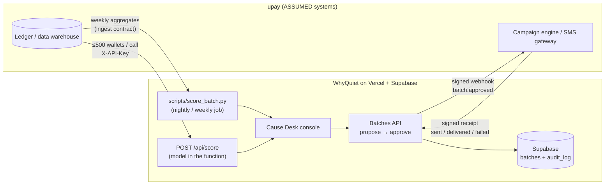

# Integration architecture: upay ledger → Cause Desk → SMS gateway

> Decisions D52 (live scoring), D53 (campaign webhook + receipts), D54 (capacity).
> Everything here runs in this repo and is tested. What we **cannot** show is a connection to upay's real
> systems: we have no access to them. Their names and field availability below are **ASSUMED**.

## 1. The whole loop



| Step | Interface | Contract | Where in code |
| --- | --- | --- | --- |
| 1. Extract | upay exports weekly aggregates for wallets silent ≥ 3 weeks | `docs/contracts/ingest.md` | upay side (ASSUMED) |
| 2a. Score in bulk | flat CSV/Parquet → `scripts/score_batch.py` | same file format | `scripts/score_batch.py` |
| 2b. Score live | `POST /api/score`, ≤ 500 wallets, `X-API-Key` | `ScoreRequest` / `ScoreResponse` at `/api/docs` | `src/api/score.py` |
| 3. Decide | analyst proposes a cause batch, a different approver approves | `docs/contracts/api.md` | `src/api/batches.py` + DB triggers |
| 4. Hand off | `POST CAMPAIGN_WEBHOOK_URL`, HMAC-signed | §3 below | `src/api/campaign.py` |
| 5. Close the loop | gateway `POST /api/campaign/receipts`, HMAC-signed | §3 below | `src/api/batches.py` |
| 6. Fallback hand-off | `GET /api/batches/{id}/export?format=csv\|json` | `ExportBatchResponse` / CSV | `src/api/batches.py` |

Bulk and live scoring call the **same function** (`src.api.score.score`), and a test checks the live endpoint
returns exactly the `seed.json` verdicts and probabilities (`tests/test_api_score.py`). There is one model,
not a demo copy.

## 2. Deployment

| Piece | Runs on | Notes |
| --- | --- | --- |
| Console (Vite build) | Vercel static | reads `seed.json`; Score page calls the API |
| API incl. model | one Vercel Python function (`api/index.py`) | `src/model/artifacts/model.txt` (0.9 MB) + `meta.json` are loaded once per cold start. Bundle ≈ 251 MB unzipped with numpy, pandas, lightgbm, scipy (measured with Linux wheels); Python limit is 500 MB (https://vercel.com/docs/functions/limitations). No sklearn at runtime. |
| Batches + audit log | Supabase Postgres | migrations applied by CD before each deploy (D51) |
| Bulk scorer | any machine with the repo (`uv run`) | same code; no web limits |
| Mock SMS gateway | local, `scripts/webhook_receiver.py` | standard library only; for demos |

Environment (`.env.example`): `SCORE_API_KEY`, `CAMPAIGN_WEBHOOK_URL`, `CAMPAIGN_WEBHOOK_SECRET`, plus the
existing Supabase pair. Each feature is off when its variable is empty.

## 3. Webhook and receipt contract

**Webhook** (on approve, and on `POST /api/batches/{id}/redeliver` by an approver):

```http
POST {CAMPAIGN_WEBHOOK_URL}
Content-Type: application/json
X-WhyQuiet-Event: batch.approved
X-WhyQuiet-Timestamp: 1791360000
X-WhyQuiet-Signature: sha256=<hex HMAC-SHA256(CAMPAIGN_WEBHOOK_SECRET, "{timestamp}.{raw body}")>
Idempotency-Key: <batch_id>

{"event":"batch.approved","batch_id":"…","cause":"fee_shock","remedy_code":"fee_shock_waiver",
 "wallet_ids":["W-…"],"cost_bdt":2500.0,"approved_by":"…","approved_at":"…",
 "message_en":"…","message_bn":"…"}
```

- The receiver checks the signature and rejects timestamps older than 300 s (replay). It dedupes on
  `Idempotency-Key`, so a redeliver never sends the same batch twice.
- One attempt, 3 s timeout, inside the approve request (serverless functions cannot run background jobs
  reliably). Success or failure is appended to the audit log as `campaign.delivered` / `campaign.failed` with
  the HTTP status. **A failed delivery never undoes the approval.** The approver can re-send.
- Customer phone numbers never leave upay: the payload holds pseudonymous wallet IDs, and the gateway maps
  them to numbers on its side (ASSUMED upay capability).

**Receipt** (gateway → WhyQuiet, same signature scheme and secret):

```http
POST /api/campaign/receipts
X-WhyQuiet-Timestamp: …   X-WhyQuiet-Signature: sha256=…

{"batch_id":"…","sent":100,"delivered":98,"failed":2,"gateway_ref":"…",
 "failed_wallet_ids":["W-…","W-…"]}
```

`failed_wallet_ids` is optional. When present it must name each failed wallet exactly once, and every ID must
belong to the batch. The console's **View SMS** panel uses it to show which wallets failed (D56).

Checks: signature and freshness (401), batch exists (404) and is approved (409), `delivered + failed ≤ sent ≤
wallet_count` (422). Stored as `campaign.receipt` with actor role `system`, and shown in the batch history.

## 4. Capacity (measured, D54)

Measured on one laptop core (Intel Core Ultra 9 185H, Windows 11, Python 3.12), scoring all 3,000
population B wallets end to end (file read, grouping, validation, features, model, explanations):

| Measurement | Result |
| --- | --- |
| Bulk scorer, 3,000 wallets, 4 runs | 4.9–6.0 s → **500–611 wallets/s** |
| One API request, 500 wallets (local) | 2.45 MB in, 0.57 MB out, **0.73–0.87 s** |
| Output vs `seed.json` | identical verdicts for all 3,000 (652 refused) |

What that means for upay (inputs ASSUMED, from `economics.md`):

| Workload | Wallets | Time at 500 wallets/s, one core |
| --- | --- | --- |
| First full pass over the modelled dormant base | 3.63M | ≈ 2.0 h |
| Weekly run on newly dormant wallets (1.27M/year ÷ 52) | ≈ 24,400 | ≈ 49 s |
| Same weekly run through the API, 500 per call | 49 calls | ≈ 40 s (49 × the local 0.8 s request) |

Wallets are scored independently, so the full pass splits across processes or concurrent API calls. Vercel
auto-scales functions to 30,000 concurrent on Hobby/Pro (https://vercel.com/docs/functions/limitations).
Linear speed-up with more processes is **ASSUMED**, not measured. Live latency on Vercel (cold start
included) is **UNVERIFIED** until measured after deploy.

Reproduce: `uv run python scripts/score_batch.py --in <ledger.parquet> --out triage.csv` prints wallets/s.

## 5. Failure modes

| Failure | What happens |
| --- | --- |
| Supabase down | read screens keep working from `seed.json`; API-key scoring keeps working; sign-in and batches return 503 |
| Model file missing | `/api/score` 503, `/api/health` shows `model_version: null` |
| Gateway down or 5xx | approval stands; `campaign.failed` in the audit log; approver re-sends |
| Duplicate webhook | receiver dedupes on `Idempotency-Key` |
| Forged or replayed receipt | 401, nothing stored |
| Bad ledger rows | 422 naming the field; the Score page shows the message |

## 6. Run the loop locally

```bash
# terminal 1: mock SMS gateway
CAMPAIGN_WEBHOOK_SECRET=dev-secret uv run python scripts/webhook_receiver.py --api http://localhost:8008
# terminal 2: API with webhook + API key
CAMPAIGN_WEBHOOK_URL=http://localhost:9009/hook CAMPAIGN_WEBHOOK_SECRET=dev-secret SCORE_API_KEY=dev-key \
  uv run --env-file .env uvicorn src.api.main:app --port 8008
# terminal 3: score a ledger the way a upay backend would
python -c "import pandas as pd, json; from scripts.score_batch import ledger_wallets; \
print(json.dumps({'wallets': ledger_wallets(pd.read_csv('web/public/sample-ledger.csv'))}))" > body.json
curl -s -X POST localhost:8008/api/score -H "X-API-Key: dev-key" -H "Content-Type: application/json" -d @body.json
```

Then propose and approve a batch in the console. Terminal 1 prints the signed batch with both messages, and
the batch history shows `campaign.delivered` followed by the gateway's `campaign.receipt`.
