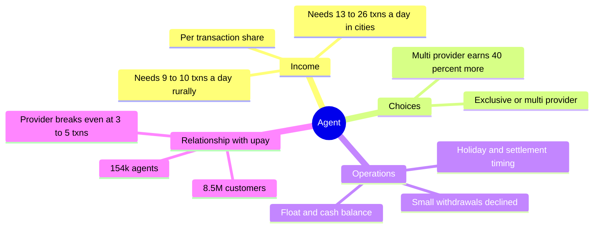
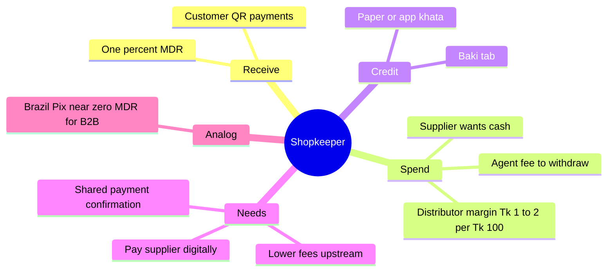
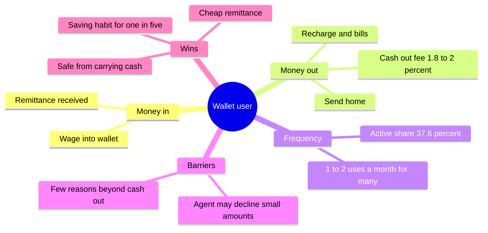

# docs/v3/interviews.md: evidence notes and maps for agent, shopkeeper, wallet user

Compiled 3 Oct 2026. These are NOT first-hand interviews. They answer the two v3 interview questions per role using published studies, regulator or company figures and news. Nothing is quoted; all items are paraphrased. Items marked (inferred) are my reading of the evidence, not a sourced fact. Items marked (derived) are my arithmetic on sourced numbers. Fraud, scams and mule themes are excluded, per CONTEXT_v3.

The two questions:

- Q1. What did you do last week with your wallet that was annoying or that you avoided?
- Q2. What do you pay for each month?

Source keys (URLs at the bottom): S1 TIB/BB 2024 | S2 upay/TBS | S3 BCG agents | S4 Hazra | S5 USAID survey | S6 garment wages | S7 AEA remittance | S8 MicroSave | S9 TIB fees | S10 FE cash-out | S11 DS landscape | S12 MPRA | S13 baki.bd | S14 BB definition | S15 GSMA | S16 velocity paper | F earlier file `field-notes.md`

---

## Context numbers (all roles)

- 237 million registered MFS accounts at Dec 2024, of which 37.6% active (S1). Active historically means a transaction in the last three months (S14).
- GSMA found registered counts overstate unique users because of dormant accounts and multi-SIM churn. This is 2014 data (S15).
- upay at end-2023: about 8.5 million registered customers, about 154,000 agents, 14,519 merchants, Tk 43.32 crore revenue and Tk 85.43 crore loss for the year (S2).
- Derived: about 55 registered customers per upay agent (8.5M / 154k), and about Tk 2,800 of upay revenue per agent per year (Tk 43.32 crore / 154k). The second figure is company revenue, not agent income.

---

# ROLE 1: AGENT

## Interview notes (3 agents, from evidence)

**Q1. Annoying or avoided**

- Low volume is the core problem. Agents doing fewer than 15 to 20 transactions a day reported significantly lower satisfaction. The sample was multi-country, 2019 (S3).
- Providers break even at 3 to 5 agent transactions a day. Agents need 9 to 10 in rural areas and 13 to 26 in urban areas (S3).
- Non-exclusive agents, serving several providers, earned over 40% more profit than exclusive ones in Kenya and Bangladesh (S3).
- Customers report that agents often decline small withdrawals, and that an agent is not always available when needed (S4). This is the customer's view of the agent, not the agent's own.
- Income share and float/settlement shocks: see F, entries B1 and B2.

**Q2. What they pay monthly**

- Not found. No source gives agent monthly costs (rent, float financing, runners). Ask in the field.

**What they do instead**

- Serve more providers from the same shop (S3).

**Evidence gaps**

- No upay-specific agent interviews found. No 2026 agent income data found.

## Journey map

| Stage                                   | What they do                      | Pain / friction                                         | Source |
| --------------------------------------- | --------------------------------- | ------------------------------------------------------- | ------ |
| 1. Onboard and stock float              | Join a provider, fund float       | Break-even volume is far higher for agent than provider | S3     |
| 2. Serve customers                      | Cash-in, cash-out, small requests | Small withdrawals declined; late-night unavailable      | S4     |
| 3. Rebalance cash and float             | Move cash and e-float             | Settlement and holiday shocks                           | F B2   |
| 4. Earn and settle                      | Receive commission share          | Share per Tk 1,000 is small and split three ways        | F B1   |
| 5. Decide to continue or add a provider | Add providers or lose interest    | Under 15 to 20 txns/day, satisfaction falls             | S3     |

## Empathy map

- **Says:** nothing sourced. Customers say agents decline small amounts (S4).
- **Does:** serves multiple providers where possible (S3); carries float and cash.
- **Thinks (inferred):** whether volume justifies the shop's counter space and cash risk.
- **Feels (inferred):** satisfaction drops under 15 to 20 txns/day (S3).
- **Pains:** thin per-transaction share (F B1); float shocks (F B2); low volume (S3).
- **Gains:** higher profit as non-exclusive (S3); footfall that may sell other goods (inferred).

## Mind map

---

# ROLE 2: SHOPKEEPER

## Interview notes (3 shopkeepers, from evidence)

**Q1. Annoying or avoided**

- Digital money cannot go upstream. About 37% of retailers avoid digital payments because suppliers insist on cash. Across 7.8 million small retailers, the digital payment stops at the counter (S8).
- Small businesses stay with cash because digital fees cut into thin margins (S10).
- Cash gives instant confirmation. Digital payments lack a view shared by retailer, rep, distributor and manufacturer (S8).
- In garment-area stores, the corner-store owner keeps a running tab that falls due on payday (a 2014 Kantar study). The study suggests mobile transfers could ease that record-keeping.

**Q2. What they pay monthly**

- Retailer pays about 1% fee on receipts and an agent fee to withdraw, then pays suppliers in cash. A distributor's own margin is about Tk 1 to 2 per Tk 100, so the same 1% fee takes half or more (S8).
- Rent and wages: not found.

**What they do instead**

- Pay suppliers in cash; keep a paper or app khata.

**Context on demand**

- Merchant payments rose from Tk 17 crore a day in 2019 to Tk 162 crore a day in 2023 and reached about Tk 6,000 crore a month (S11). Merchant payments still trail cash-out volume by a wide margin (S10).

**Evidence gaps**

- No 2026 shopkeeper interviews. No upay merchant study.

## Journey map

| Stage                      | What they do                | Pain / friction              | Source      |
| -------------------------- | --------------------------- | ---------------------------- | ----------- |
| 1. Accept customer payment | QR or wallet payment        | MDR cuts margin              | S10, S8     |
| 2. Hold balance            | Wallet balance builds       | Cannot pass it to a supplier | S8          |
| 3. Restock                 | Order from wholesaler       | Supplier demands cash        | S8          |
| 4. Withdraw                | Cash-out via an agent       | Agent fee on top of MDR      | S8          |
| 5. Month-end               | Collect baki from customers | Paper tab, due at payday     | Kantar 2014 |

## Empathy map

- **Says:** nothing quoted. Retailers avoid digital because suppliers want cash (S8).
- **Does:** accepts payments, cashes out, pays suppliers in cash (S8).
- **Thinks (inferred):** whether the fee leaves any margin (S10).
- **Feels (inferred):** reluctance, since the digital balance does not help restocking.
- **Pains:** layered fees (S8); no supplier acceptance (S8); baki tracking (Kantar).
- **Gains:** instant confirmation and a record (S8); more customers who prefer paying digitally (S11).

## Mind map

---

# ROLE 3: WALLET USER (garment and migrant worker; urban basic user)

## Interview notes (3 users, from evidence)

**Q1. Annoying or avoided**

- Payday in cash meant long lines and carrying cash; electronic wages are preferred by workers (S6, BTCA 2017).
- Cash-out fees are resisted: the garment federation computed Tk 155 crore lost to a 2% fee (S6, 2020), and a 2025 review says nearly half resist cash-out fees and that cost-sharing rules are unclear (S6, UNDP).
- Workers use wallets mostly for receiving wages and little for saving, spending or borrowing (S6, UNDP). bKash itself said workers would use more if there were more varied transactions (S6, 2020).
- Migrant workers value a personal wallet because agents often decline small withdrawals and may not be around at night (S4).
- Some factories returned to cash after the pandemic (S6, DS 2021).

**Q2. What they pay monthly**

- Money sent home: women garment workers averaged eight transactions a month, mostly remittances to family and phone credit, and one in five began saving monthly (S6, BSR).
- Mobile recharge, bills, merchant payments: in a small 2021 survey, the main uses were recharge (30.8%), transfers (25.8%), merchant payments (23.2%) and utility bills (20.2%). 46% preferred cash (S12).
- Wage-linked fee: the cash-out fee, about 1.8% to 2% (S6).
- National scale: utility bills and private salary payments each exceed Tk 3,000 crore a month (S11).

**What they do instead**

- Take wages as cash, or cash out immediately (S6, S10).

**Frequency evidence**

- A 2018 survey of 442 users found 42.5% used MFS only once or twice a month (cited in S12).
- Wallets are often a temporary transfer channel: cash-out volume greatly exceeds merchant payments (S10).

**Remittance effect**

- Mobile banking cut the cost of sending money to a fraction (by an order of magnitude) and raised remittances more than 25% in a field experiment. Instant sending also put pressure on urban workers (S7).

**Non-users**

- In a 2015 USAID-project survey, over 80% of non-users said they had no need. Respondents showed interest in bill payments (70%), education fees (60%) and merchant payments (55%) (S5).

**Evidence gaps**

- No upay-specific user study. No Play Store review data for upay found.

## Journey map

| Stage                     | What they do             | Pain / friction                                  | Source  |
| ------------------------- | ------------------------ | ------------------------------------------------ | ------- |
| 1. Get paid               | Wage into wallet or cash | Cash payday meant queues                         | S6      |
| 2. Cash out               | Visit an agent           | Fee of about 2%; agents may refuse small amounts | S6, S4  |
| 3. Send home              | Remit to the village     | Instant, cheaper; pressure from family demands   | S7      |
| 4. Recharge and pay bills | Airtime, bills           | Main light uses                                  | S12     |
| 5. Idle                   | Wallet unused for weeks  | 1 to 2 uses a month for many; 62.4% inactive     | S12, S1 |

## Empathy map

- **Says:** nothing quoted. Workers say they prefer e-wages, but resist cash-out fees (S6).
- **Does:** receives wage, cashes out, sends money home, recharges (S6, S12).
- **Thinks (inferred):** how much of the wage the fee takes.
- **Feels:** nervous about digital wages at first (S6, 2019 focus groups); safer without carrying cash (S6, BSR).
- **Pains:** cash-out fee (S6); no agent at night (S4); few other reasons to open the app (S6, S10).
- **Gains:** safe wage, cheap remittance (S7), saving habit for one in five (S6, BSR).

## Mind map

---

## Already solved or in progress (excluded)

- Digital khata with bKash and Nagad collection exists (S13). The basic baki ledger is not open ground.
- upay already lists utility bills, e-commerce, inward remittance, salary disbursement and airtime (LinkedIn page). The gap is usage frequency, not features.
- Wage digitisation exists, with fee-sharing between bKash and factories (S6, TBS). The unsolved part is that wages are used almost only for cash-out.

## Not verified

- I did not verify any autopay or recurring-payment mandate product in Bangladesh. Search before using it as an idea.
- Only one foreign analog is verified here: Brazil's Pix, with near-zero MDR enabling B2B payments (S8, MicroSave Part 2).

## Sources

- S1 https://www.ti-bangladesh.org/en/articles/research/7261
- S2 https://www.tbsnews.net/economy/stocks/upays-accumulated-losses-cross-tk300cr-2023-877946
- S3 https://www.bcg.com/publications/2019/how-mobile-money-agents-can-expand-financial-inclusion
- S4 https://onlinelibrary.wiley.com/doi/full/10.1002/isd2.12166 (search snippet only; the page blocked fetching)
- S5 https://www.findevgateway.org/sites/default/files/publications/files/mobile_financial_services_in_bangladesh_a_survey_of_current_services_regulations_and_usage_in_select_usaid_projects_0.pdf
- S6 https://www.betterthancash.org/news/why-women-workers-and-managers-prefer-electronic-wage-payments-bangladesh ; https://www.thedailystar.net/business/news/garment-factories-moving-away-digital-wage-payment-2061937 ; https://connected2work.org/blog/from-unbanked-to-fully-digital-a-look-behind-bangladeshs-online-money-transfers/ ; https://www.undp.org/bangladesh/blog/digital-wages-can-unlock-womens-economic-power-bangladesh ; https://www.bsr.org/en/blog/what-if-all-garment-workers-in-bangladesh-were-financially-included ; https://workerdiaries.org/garment-workers-experience-with-wage-digitization-in-bangladesh/ ; https://www.tbsnews.net/economy/rmg/bkash-steps-help-apparel-workers-get-salary-69523 ; https://finclusion.org/blog/let-me-keep-my-cash-digitizing-wages-in-the-garment-sector-of-bangladesh.html (Kantar 2014)
- S7 https://aeastaging.aeaweb.org/research/poverty-migration-mobile-banking-bangladesh
- S8 https://www.microsave.net/2026/05/14/why-bangladeshs-supply-chains-still-run-on-cash-despite-digitization/ ; https://www.microsave.net/2026/05/14/building-the-rails-for-b2b-digitization-in-bangladeshs-retail-supply-chains/
- S9 https://www.ti-bangladesh.org/images/2025/report/mfs/Executive-Summary-Mobile-Financial-Services-Sector-En.pdf?v=1
- S10 https://www.thefinancialexpress.com.bd/special-issues/bangladesh-on-cusp-of-transition-to-cashless-economy
- S11 https://www.thedailystar.net/supplements/mfs-and-financial-inclusion-bangladesh/news/changing-landscape-mobile-money-bangladesh-3530006
- S12 https://mpra.ub.uni-muenchen.de/109974/1/MPRA_paper_109974.pdf
- S13 https://baki.bd/
- S14 https://bangladeshpost.net/posts/number-of-active-mobile-banking-accounts-decreasing-19203
- S15 https://www.gsma.com/solutions-and-impact/connectivity-for-good/mobile-for-development/country/bangladesh/mobile-money-usage-in-bangladesh-a-side-by-side-comparison-of-demand-and-supply-side-data/
- S16 https://www.researchgate.net/publication/400493865_Title_Mobile_Financial_Services_MFS_and_Monetary_Velocity_An_Empirical_Study_of_the_Bangladeshi_Economy
- upay services: https://www.linkedin.com/company/upay-ucbfintech
